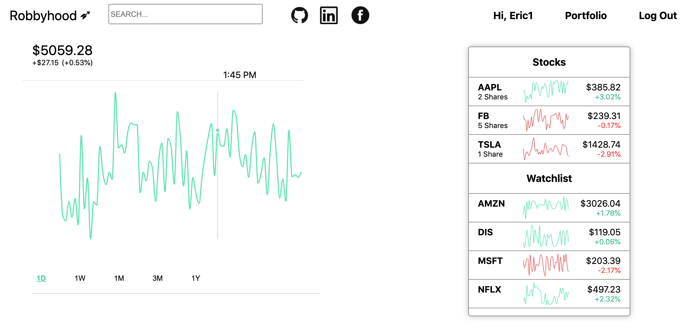
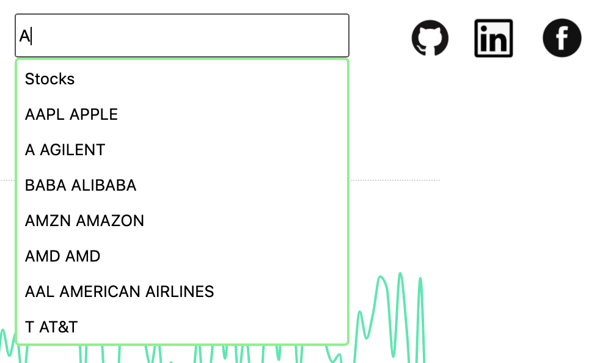
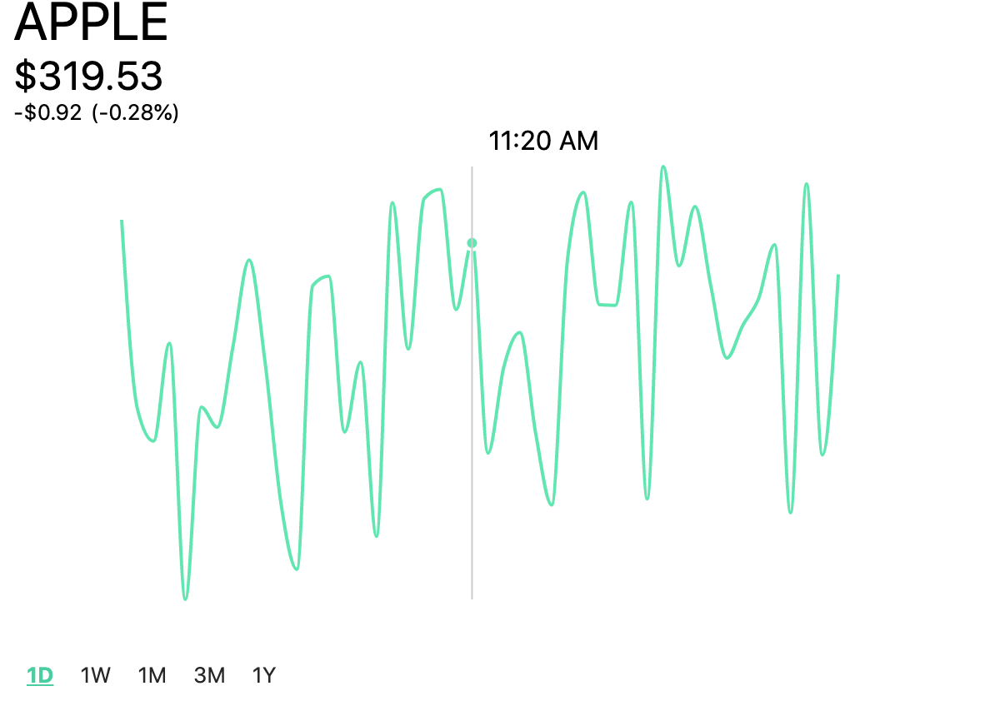
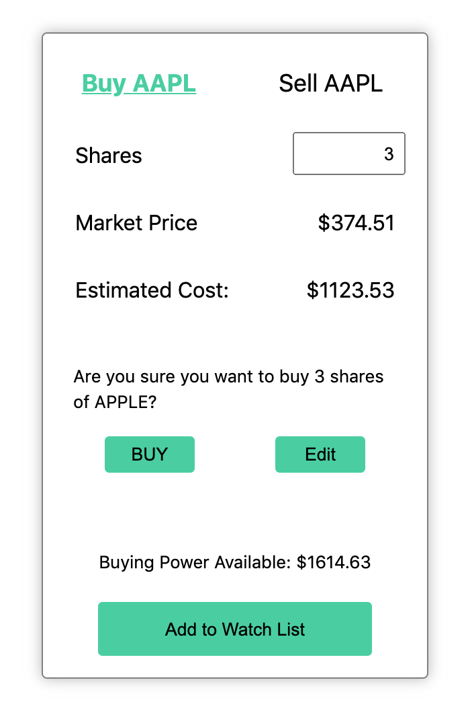
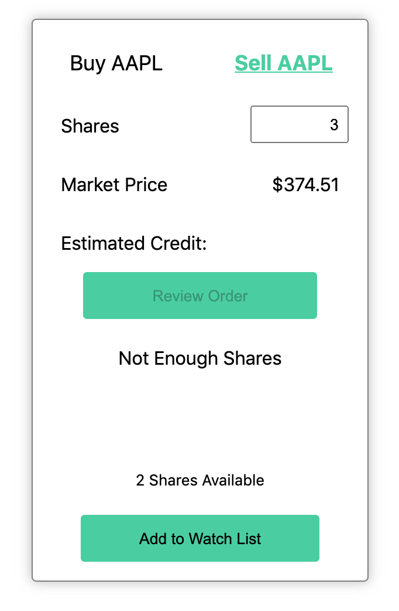
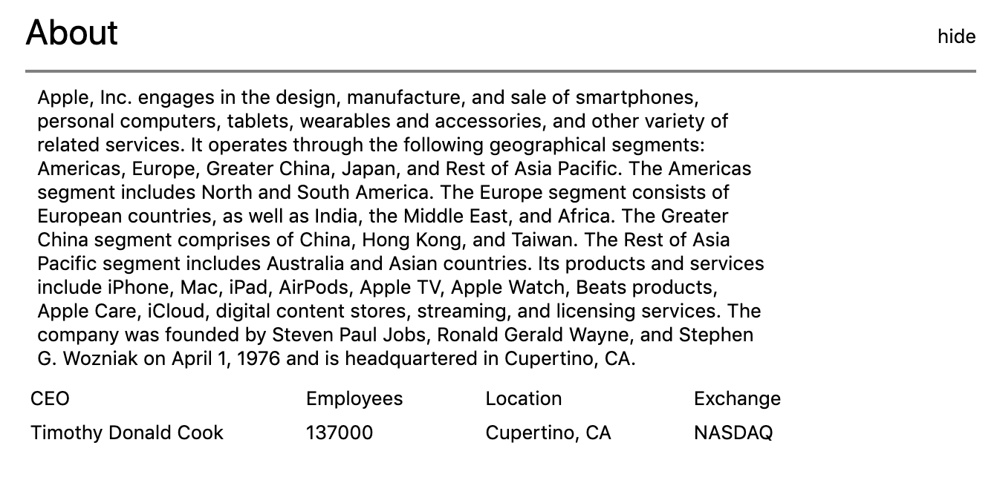
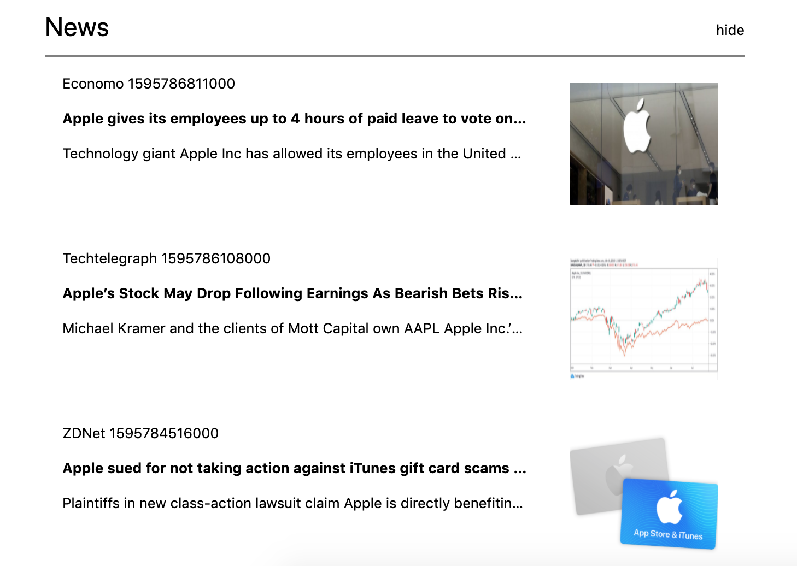

# Overview

Robbyhood is a single page app that allows users to learn stock brokerage without using actual money.  It is heavily influenced by [Robinhood](https://robinhood.com/).  

Please check it out [here](https://robbyhood.herokuapp.com/).

## Technologies Used:

### Backend
* Ruby on Rails
* Postresql
* AJAX
* IEX API

### Frontend
* React/Redux
* Javascript
* HTML/CSS
* Recharts

## Technical Challenges
* Calculating user portfolio with live data.
* Manipulating JSON object structure in both backend and frontend for fast lookup.
* Utilizing Recharts to display acurate information on graphs and tooltips.


## Features:

### Secure User Sign-up/Login:

* Secure sign up and sign in using BCrypt.
* Non logged in users are not able to go to stocks or profile pages with Protected Routes.

### User Portfolio Page:

Users can see what stocks they own and how much money they gained and lost in single day, week, month, 3 month and year timeframe.  Users can also add stocks to their watchlist to keep an eye on stocks they are interested in buying in the future.



### Stock Seachbar: 

Users can search up a stock in the stock search bar with the stock symbol(ticker) or name to take them to the single stock show page. 



#### Sample Code: 

The follow code snippet shows the function which a user can type in the first matching letters of a stock name or symbol(ticker).

```
    matches() {
        const matches = [];

        if (this.state.inputValue.length === 0) {
            return matches
        }
        let stocks = Object.values(this.props.stocks)
        stocks.forEach( stock => {
            const subName = stock.name.slice(0, this.state.inputValue.length);
            const subSym = stock.symbol.slice(0, this.state.inputValue.length);
            if (subName.toLowerCase() === this.state.inputValue.toLowerCase() ||
                subSym.toLowerCase() === this.state.inputValue.toLowerCase()
            ) {
                matches.push(stock);
            }
        });

        if (matches.length === 0) {
            matches.push({name: 'No Matches', symbol: false})
        }

        return matches
    }

```

### Stock Show Page:

Users are able to search stocks and see prices from timeframes of 1 Day, 1 Week, 1 Month, 3 Months and 1 Year.



#### Sample Code: 

This code snippet shows util function that takes in symbols, single symbol, and range for dynamic data endpoint fetching.  It also utilizes the batch request route allowing single fetch call to grab multiple stock data end points.

```
export const fetchMultiStocks = (symbols, range) => (
    $.ajax({
        url: `https://sandbox.iexapis.com/stable/stock/market/batch?symbols=${symbols}&types=chart&range=${range}&token=${window.iexAPIKey}`,
        method: 'GET'
    })
);

```

#### Sample Code:

The following code snippet shows use of Recharts Custom Tool Tip function with vanilla javascript to change the price amount when a user moves the cursor over the graph:
```
const CustomTooltip = (props) => {
    let oldPrice = props.oldPrice
    if (props.active) {
        const price = document.getElementById('stockPrice')
        const change = document.getElementById('changePrice')
        const update = document.getElementById('fluxPercent')
        if (props.payload[0] && props.payload[0].payload) {
            let currPrice = (props.payload[0].payload.high)
            let flux = props.setFlux(currPrice - oldPrice)
            price.innerText = `$${props.setPrice(currPrice)}`
            change.innerText = props.addSymbol(flux)
            update.innerText = props.setFluxPercent(currPrice, oldPrice)
        }
        return (
            <div >
                {/* <p>{props.date}</p> */}
                <p>{props.label}</p>
            </div>
        );
    }

    return null;
};

```
### Buy Sell Stock

Users can buy or sell stocks on a single component.  Components includes error rendering such as 'Not enough Buying Power' or 'Not enough Shares' and also button disables if there is an error.




#### Code Snippet

```
        if transaction_amount > buying_power && @transaction.transactions_type == 'buy'
            render json: ['Not enough buying power'], status: 401
        elsif @transaction.num_shares <= 0 
            render json: ['Shares must be greater than 0'], status: 422
        elsif @transaction.num_shares > shares_owned && @transaction.transactions_type == 'sell'
            render json: ["Not enough shares"], status: 401
        else 
            if @transaction.save 
                render :show, status: 200
            else 
                render json: @transaction.errors.full_messages, status: 422
            end
        end

```

### News and Company Info

Users can see some actual information about the company and recent news regarding the company.

#### About: 


#### News:

